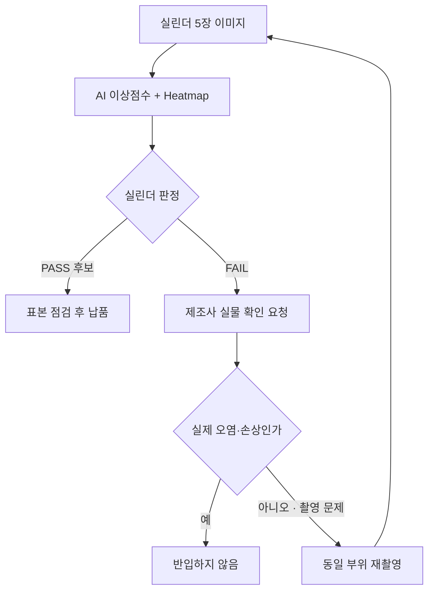

# Human-in-the-Loop Inspection

## Overview

모델이 **선별하고 사람이 확정하는** 운영 구조다. AI 는 최종 결정권을 갖지 않고, 이상 의심 사례를 골라 사람의 검토 대상으로 올린다.

핵심은 역할 분담이다 — 모델은 **전수 검토의 부담**을 덜고, 사람은 **되돌릴 수 없는 판단**을 맡는다.

## Details

### 왜 초기에 이 구조를 택하는가

[[2026-07-31-PatchCore-반도체-특수가스-용기-표면-이상탐지-제안서|제안서]]는 세 가지 이유를 든다.

1. **라벨이 아직 만들어지는 중이다** — 기존 판정 이력이 구조화되어 있지 않아 모델 성능을 신뢰할 근거가 부족하다.
2. **오판의 결과가 비대칭이다** — FN 은 안전사고로 이어질 수 있다 ([[Safety-Critical Threshold Policy]]).
3. **FP 를 해소할 경로가 필요하다** — 보수적 임계값의 대가인 오탐을 사람이 흡수한다.

### 루프의 실제 동작

FAIL 판정이 곧 반품이 아니라 **확인 요청**이라는 점이 중요하다. 이 완충 때문에 모델이 다소 과하게 경보를 울려도 시스템이 견딘다.

### 사람이 개입하는 지점은 두 곳이다

- **판정 단계** — FAIL 후보의 실물 확인, 재촬영 여부 결정
- **라벨 단계** — [[한도견본]] 경계 사례의 복수 검토 및 확정

두 번째가 종종 간과된다. HITL 은 운영 구조일 뿐 아니라 **학습 데이터를 만들어 내는 구조**이기도 하다. 검토 과정에서 확보되는 FAIL 사례를 순차적으로 학습에 추가한다는 제안서의 계획이 이에 해당한다.

### 자동화 수준은 고정이 아니다

제안서는 "초기에는" 이라는 단서를 달았다. HITL 은 종착점이 아니라 **신뢰가 축적되면 조정될 설정**이다. 다만 어떤 조건이 충족되면 자동화 비율을 올릴지는 정의되어 있지 않다.

> [!note] Bias Check
> Counter-argument: HITL 은 안전판처럼 보이지만 **자동화 편향(automation bias)** 을 만들 수 있다. 사람이 AI 판정을 습관적으로 승인하기 시작하면 명목상 사람이 결정하되 실질적으로는 모델이 결정하게 된다. AI 의 PASS 를 표본 점검하는 절차가 이에 대한 부분적 방어지만, 검토자의 주의력 저하 자체는 측정되지 않는다.
> Data gap: 검토 1 건당 소요 시간, 일일 처리 가능 건수, 검토자 수가 확인되지 않았다. 이 값 없이는 루프의 처리 용량을 알 수 없다.

> [!question] Open Question
> **자동화 수준을 올리는 기준은 무엇인가?** "FN 0 건이 N 개월 지속" 같은 정량 조건이 필요하지만, 제안서는 초기 구조만 정의하고 졸업 조건을 제시하지 않았다.

## Related

- [[Safety-Critical Threshold Policy]] — 이 구조가 흡수해야 하는 오탐을 만들어 내는 정책
- [[한도견본]] — 사람이 경계 사례를 확정하는 기준
- [[Visual Anomaly Detection]] — 모델이 담당하는 선별 단계

## Sources

- [[2026-07-31-PatchCore-반도체-특수가스-용기-표면-이상탐지-제안서]] — §3.1 전체 접근 방식, §3.4 라벨링, §3.6 판정 로직, §7.2 기대효과
