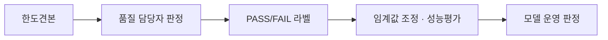

# 한도견본

## Overview

한도견본은 제조 품질검사에서 **합격의 경계선을 물리적으로 고정한 기준물**이다. "이 정도까지는 PASS, 이보다 나쁘면 FAIL" 의 그 '이 정도' 를 실물 또는 사진으로 못 박아 둔다.

말로 쓴 기준("경미한 스크래치는 허용")은 사람마다 다르게 읽힌다. 한도견본은 그 모호함을 **비교 가능한 사물**로 바꾼다.

## Details

### AI 검사에서의 역할 — 모델이 아니라 라벨의 기준

이상탐지 모델은 한도견본을 학습하지 않는다. 한도견본은 **학습 데이터의 정답을 만드는 기준**으로 작동하며, 다음 경로로 모델에 영향을 준다.

즉 한도견본이 흔들리면 라벨이 흔들리고, 라벨이 흔들리면 모델 성능의 상한이 내려간다. [[2026-07-31-PatchCore-반도체-특수가스-용기-표면-이상탐지-제안서|제안서]]가 라벨 불일치를 "모델 성능 한계로 이어질 수 있는" 위험으로 별도 항목화한 이유다.

### 경계 사례가 본질적 난점이다

한도견본에 **가까운** 사례가 가장 어렵다. 제안서는 이에 대해 세 가지 규칙을 둔다.

- 경계 사례는 품질 담당자의 **복수 검토**를 거쳐 확정한다.
- 라벨은 단순 다수결이 아니라 **현장 기준과 안전 리스크를 우선**한다.
- 판정 기준이 변경되면 **변경 시점과 근거를 함께 기록**한다.

세 번째가 특히 중요하다. 기준이 조용히 바뀌면 과거 라벨과 현재 라벨이 서로 다른 정의를 갖게 되고, 시간순으로 분할한 평가([[Temporal Split and Data Leakage]])가 오염된다.

### 촬영 불량은 PASS 가 아니다

제안서는 흐림·과노출·가림 등으로 **정상 여부를 확인할 수 없는 이미지를 PASS 로 처리하지 않고** 재촬영 필요 FAIL 후보로 분류한다. "판단 불가" 를 "이상 없음" 으로 흡수하지 않는다는 원칙이며, [[Safety-Critical Threshold Policy]] 의 비대칭 비용 구조와 같은 방향이다.

> [!note] Bias Check
> Counter-argument: 한도견본이 있다고 판정이 자동으로 일관되지는 않는다. 조명·각도·모니터 색보정에 따라 같은 견본과 같은 사진을 두고도 다른 결론이 나올 수 있다. 견본은 모호함을 줄이지 완전히 제거하지 않는다.
> Data gap: 이 페이지는 제안서 한 건에 의존한다. 사내 한도견본의 실제 형태(실물 / 사진 / 등급 단계 수)와 개정 이력이 확인되지 않았다.

> [!question] Open Question
> 한도견본이 **개정되면 과거 라벨을 소급 재판정할 것인가?** 재판정하지 않으면 라벨 정의가 시점마다 달라지고, 재판정하면 비용이 크다. 제안서는 변경 기록만 언급하고 소급 정책은 정하지 않았다.

## Related

- [[Visual Anomaly Detection]] — 이 기준으로 라벨이 만들어지는 문제 설정
- [[Human-in-the-Loop Inspection]] — 경계 사례를 사람이 확정하는 구조
- [[Safety-Critical Threshold Policy]] — 판단 불가를 FAIL 쪽으로 두는 비대칭 원칙
- [[Temporal Split and Data Leakage]] — 기준 변경이 평가를 오염시키는 경로

## Sources

- [[2026-07-31-PatchCore-반도체-특수가스-용기-표면-이상탐지-제안서]] — §3.4 라벨링 및 한도견본 적용, §4.2 라벨 구축 계획, §6 예상 어려움
