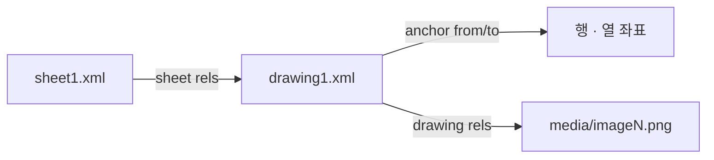

# Excel 임베디드 이미지 추출

## Overview

Excel 워크시트에 **이미지 객체로 삽입된** 사진을 파일로 빼내면서, 각 사진이 어느 행(= 어느 실린더)에 붙어 있었는지를 함께 복원하는 작업이다.

핵심 난점은 이미지 자체가 아니라 **위치 정보**다. 이미지 바이너리만 뽑으면 `image1.png … image5000.png` 라는 순서 없는 더미가 되고, 어느 사진이 어느 실린더 것인지 알 수 없다.

> [!warning] 스크린샷·복사 붙여넣기 금지
> 화면 캡처나 이미지 뷰어를 거치면 **압축 손실과 리샘플링**이 발생한다. [[Patch-based High-Resolution Inspection]] 에서 다루듯 미세 결함은 몇 픽셀 크기이므로, 원본 바이너리를 그대로 꺼내는 것 외의 방법은 프로젝트를 시작 전부터 망가뜨린다.

## Details

### .xlsx 내부 구조

`.xlsx` 는 ZIP 아카이브다. 압축을 풀면 대략 다음 구조가 나온다.

```
xl/
├── worksheets/sheet1.xml              # 셀 값
├── worksheets/_rels/sheet1.xml.rels   # 시트 → drawing 연결
├── drawings/drawing1.xml              # 이미지 배치(anchor) 정보
├── drawings/_rels/drawing1.xml.rels   # drawing → media 파일 연결
└── media/image1.png                   # 실제 이미지 바이너리
```

이미지와 셀 위치를 잇는 것은 **관계(relationship) 사슬**이다.



### 절차

1. **원본 확보 및 동결** — 메일 첨부 Excel 을 별도 폴더에 복사하고 **수정하지 않는다**. 파일명·수신일·제조사를 기록한다.
2. **ZIP 열기** — `.xlsx` 를 zip 으로 연다. 파이썬이면 `zipfile` 로 충분하다.
3. **시트 → drawing 매핑** — `xl/worksheets/_rels/sheetN.xml.rels` 에서 `drawing` 타입 관계를 찾아 어느 drawing 파일이 어느 시트에 속하는지 파악한다.
4. **anchor 파싱** — `xl/drawings/drawingN.xml` 의 `xdr:twoCellAnchor` / `xdr:oneCellAnchor` 요소에서 `xdr:from` 의 `xdr:col`·`xdr:row` 를 읽는다. **이 행 번호가 실린더 행과 이미지를 잇는 열쇠다.**
5. **이미지 관계 해석** — 같은 anchor 안의 `a:blip` 에 있는 `r:embed` 값을 `xl/drawings/_rels/drawingN.xml.rels` 에서 조회해 실제 `media/imageN.ext` 경로를 얻는다.
6. **바이너리 추출** — 해당 media 파일을 **재인코딩 없이** 그대로 저장한다.
7. **행 정보 결합** — 4 에서 얻은 행 번호로 `sheetN.xml` 의 셀 값(실린더 ID, 검사일 등)을 읽어 파일명 또는 매핑표에 기록한다.

### 추출 후 반드시 하는 감사

[[2026-07-31-PatchCore-반도체-특수가스-용기-표면-이상탐지-제안서|제안서]]는 추출을 신뢰하지 않고 **표본을 수동 대조**하도록 정했다. 확인 항목은 다음과 같다.

| 항목 | 확인 내용 |
|---|---|
| 누락 | 실린더당 이미지가 5 장 모두 나왔는가 |
| 중복 | 같은 이미지가 여러 실린더에 매핑되지 않았는가 |
| 순서 | 촬영 순서(= View)가 뒤바뀌지 않았는가 |
| 매핑 | 이미지가 엉뚱한 실린더 ID 에 붙지 않았는가 |
| 화질 | 해상도·초점·밝기·과노출·압축 손상 |

마지막 항목은 복구 불가능한 손실을 조기에 발견하기 위한 것이다. Excel 에 삽입되기 **전에** 이미 압축된 이미지는 어떤 후처리로도 되살릴 수 없다.

### 자주 걸리는 함정

- **`oneCellAnchor` 와 `absoluteAnchor`** — 대부분 `twoCellAnchor` 지만, 셀에 고정되지 않고 떠 있는 이미지는 행 정보를 얻을 수 없다. 이런 경우 삽입 순서에 의존해야 하며 오매핑 위험이 커진다.
- **행 번호는 0 기반** — `xdr:row` 는 0 부터 시작한다. 화면의 Excel 행 번호와 1 차이가 난다.
- **시트가 여러 개** — drawing 이 시트마다 따로 있다. 시트 하나만 처리하고 끝내면 조용히 일부가 누락된다.
- **이미지 확장자 혼재** — `.png` 와 `.jpeg` 가 섞일 수 있다. 확장자를 가정하지 말고 media 경로에서 읽는다.

> [!note] Bias Check
> Counter-argument: `openpyxl` 같은 라이브러리로 더 간단히 처리할 수도 있다. 다만 라이브러리에 따라 이미지 위치 정보 지원이 제한적이거나 재인코딩이 개입할 수 있어, 화질 보존이 최우선이라면 원시 XML 파싱이 더 안전하다. 어느 쪽이 나은지는 실제 파일로 확인해야 한다.
> Data gap: 위 내부 구조와 함정 목록은 OOXML 일반 지식에 기반한 것으로, **이 프로젝트의 실제 Excel 파일에 대해 검증되지 않았다.** 제안서 자체는 "이미지 바이너리와 Drawing Anchor 정보를 직접 읽는다" 는 방침만 밝히고 구현 세부는 다루지 않는다.

> [!question] Open Question
> 제조사마다 Excel 양식이 다른가? 양식이 다르면 행·열 위치 규칙이 달라져 추출 코드가 제조사별 분기를 가져야 한다. 제안서는 이 가능성을 언급하지 않았다.

## Related

- [[Patch-based High-Resolution Inspection]] — 추출된 화질이 그대로 상한이 되는 다음 단계
- [[Visual Anomaly Detection]] — 이 데이터로 학습할 문제 설정

## Sources

- [[2026-07-31-PatchCore-반도체-특수가스-용기-표면-이상탐지-제안서]] — §3.2 Excel 이미지 객체 추출, §7.1 예상 산출물
