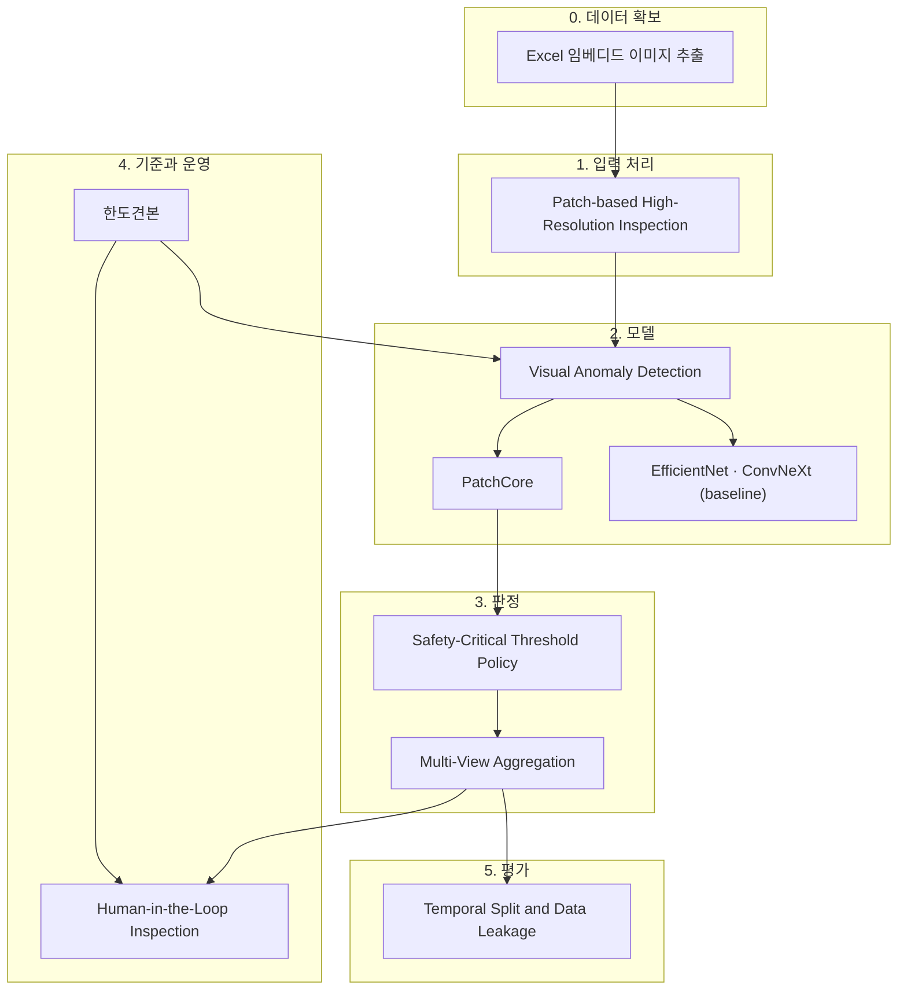

# MOC — Visual Anomaly Detection

산업 현장의 **외관 이상탐지** 를 다루는 지식 묶음이다. 출발점은 [[2026-07-31-PatchCore-반도체-특수가스-용기-표면-이상탐지-제안서|불소가스 실린더 표면 검사 현업과제]] 이지만, 아래 개념 대부분은 "정상은 많고 결함은 드물며 놓치면 위험한" 모든 검사 문제에 적용된다.

## 전체 구조

## 1. 문제 설정

- [[Visual Anomaly Detection]] — 결함을 배우는 대신 정상을 배우는 문제 틀. 언제 이 설정을 택하는가.

## 2. 방법

- [[PatchCore]] — 정상 패치 메모리 뱅크 + 최근접 이웃 거리. 이 프로젝트의 주 모델.
- [[Patch-based High-Resolution Inspection]] — 몇 픽셀짜리 결함을 리사이즈로 죽이지 않는 입력 처리.
- [[EfficientNet]] · [[ConvNeXt]] — 지도학습 분류가 가능한지 확인하는 대조군 백본.

## 3. 판정 논리

- [[Safety-Critical Threshold Policy]] — 두 오류의 비용이 비대칭일 때 임계값을 어디에 둘 것인가.
- [[Multi-View Aggregation]] — 이미지 5 장을 실린더 1 대의 결론으로 합치는 규칙과 그 대가.

## 4. 정답의 기준과 운영

- [[한도견본]] — 합격 경계선을 사물로 고정한 품질 기준. 라벨의 원천.
- [[Human-in-the-Loop Inspection]] — AI 가 선별하고 사람이 확정하는 구조.

## 5. 평가 설계

- [[Temporal Split and Data Leakage]] — 그룹 누수와 시간 누수를 함께 막는 분할.

## 6. 데이터 확보

- [[Excel 임베디드 이미지 추출]] — 워크북 안의 사진을 화질 손실 없이, 행 매핑과 함께 꺼내기.

---

## 이 묶음의 관통 논리

> [!tip] Key Insight
> 이 클러스터의 페이지들은 독립적인 기법 목록이 아니라 **하나의 비대칭에서 파생된 연쇄**다. "FAIL 을 놓치는 비용 ≫ 오탐의 비용" 이라는 전제가 임계값 정책을 정하고([[Safety-Critical Threshold Policy]]), 그 정책이 통합 규칙을 OR 로 만들고([[Multi-View Aggregation]]), 그 결과 늘어난 오탐을 사람이 흡수하는 구조가 필요해진다([[Human-in-the-Loop Inspection]]). 모델 선택([[PatchCore]])조차 "라벨이 없다" 는 조건과 "위치를 보여줘야 한다" 는 운영 요구에서 따라 나온 결과다.
>
> 즉 **모델이 먼저가 아니라 비용 구조가 먼저**다.

> [!question] Open Question
> 이 묶음은 현재 **제안서 한 건**에만 근거한다 (`evidenceScope: single-source`). PatchCore 원논문, 이상탐지 서베이, MVTec AD 같은 벤치마크를 ingest 하면 대부분의 페이지가 `multi-source-primary` 로 올라가고 `confidence` 재산정이 가능해진다. 다음 ingest 우선순위로 둘 만하다.

## Related

- [[MOC-Knowledge Management]] — 이 볼트의 다른 주제 묶음
- [[index]] — 마스터 인덱스
